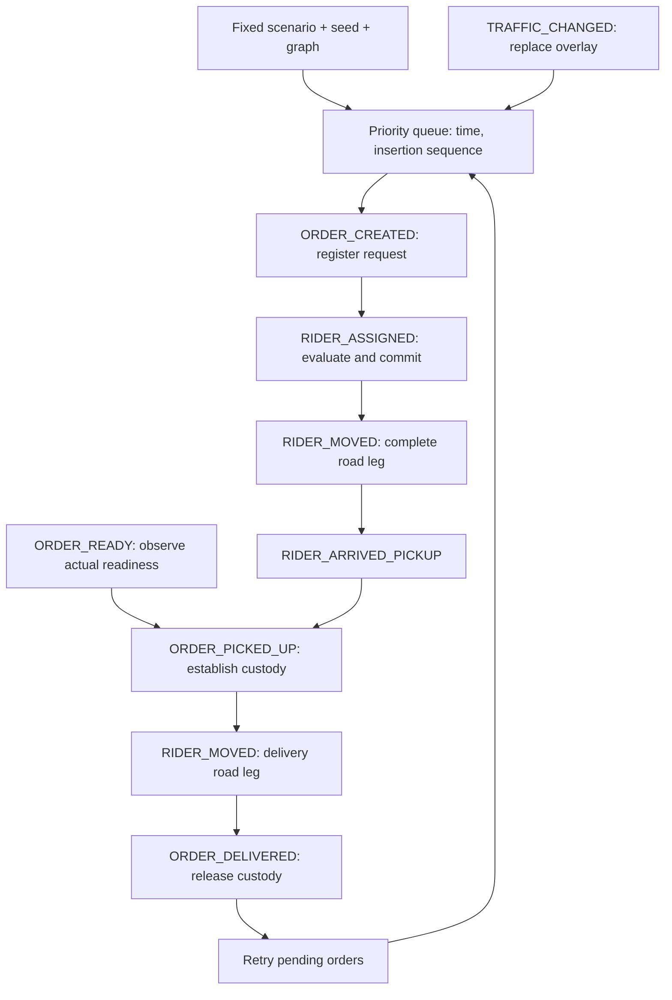

# Delivery simulation

Phase 15 implements `roadrunner-simulation` and the CLI command:

```bash
cargo run -p roadrunner-cli -- simulate data/fixtures/phase-15/seeded-deliveries.json
cargo run -p roadrunner-cli -- simulate data/fixtures/phase-15/seeded-deliveries.json --json
```

The library entry point is `simulate(&FrozenGraph, &SimulationScenario)`. Each call
creates a fresh world and owns its logical clock, event queue, seeded preparation
generation, execution history, and observed metrics. It borrows an immutable Roadrunner
graph and shares dispatch/domain transitions. No host clock or sleep controls execution.
See [ADR 0015](adr/0015-deterministic-simulation-runtime.md).

## Scenario document

The CLI JSON envelope contains `graph` and `scenario`. Unknown fields are rejected.
All instants/durations must be finite non-negative seconds in a declared logical domain.
Scenario `schema_version` must be 1. The included [fixture](../data/fixtures/phase-15/seeded-deliveries.json)
is a complete runnable example.

`graph` supports:

- `kind: "inline"`: `profile`, `nodes`, and `roads`. Nodes have integer `id` and canonical
  `coordinate: { latitude_e7, longitude_e7 }`. IDs are contiguous from zero and identify
  finalized graph nodes. Roads have `id`, `from`, `to`, positive `speed_kph`, `bidirectional`,
  and optional canonical geometry. Missing geometry uses a straight endpoint segment.
  This is synthetic core graph construction, not an alternative routing implementation.
- `kind: "artifact"`: `path` to a validated core graph artifact. Relative paths resolve
  from the scenario document directory. Artifact scenarios require an exact
  `scenario.graph_snapshot_digest`. This allows simulation on OSM-derived graphs while
  keeping ingestion outside the engine; entity node IDs belong to that snapshot.

`scenario` fields:

| Field | Meaning |
| --- | --- |
| `schema_version` | 1 |
| `seed` | Explicit unsigned 64-bit seed, recorded even for fixed inputs |
| `start_seconds`, `end_seconds` | Inclusive observation window; end is no earlier than start |
| `routing_epoch_seconds` | Dispatch instant corresponding to routing second zero; no later than start |
| `graph_snapshot_digest` | Optional for inline graphs, mandatory for artifact loading |
| `dispatch` | `basic`, `nearest_rider`, `lowest_pickup_eta`, `lowest_completion_time`, or `preparation_aware` (with `idle_penalty_weight`), as tagged `kind` objects |
| `riders` | Initial `id`, graph `node`, scalar `capacity`, and operational `available` boolean |
| `orders` | Scheduled request facts and independently generated actual readiness |
| `initial_traffic` | Complete list of directed `edge_id`/`multiplier` overrides; defaults to normal |
| `traffic_changes` | `at_seconds` plus replacement `overrides`; omitted edges return to normal |

Orders carry `id`, `pickup_node`, `dropoff_node`, `created_at_seconds`, optional
`expected_ready_at_seconds`, `actual_readiness`, optional `deadline_seconds`, and scalar
`demand`. Store/restaurant and customer entities are represented by their pickup/dropoff
locations and readiness facts. There are no kitchen queues or customer account models.

Actual readiness is either:

```json
{ "kind": "fixed", "at_seconds": 60 }
```

or a seeded delay after creation:

```json
{ "kind": "seeded_delay", "min_seconds": 30, "max_seconds": 70 }
```

Delay bounds must be ordered. The versioned `splitmix64-upper53/v1` generator processes
seeded orders in canonical identity order before dispatch. Its discrete uniform source
is in `[0, 1)`; rounding can place the resulting delay on an endpoint. Fixed actual
readiness may precede creation for stock already ready. The observation is received at
creation and retains its original ready timestamp. Readiness-aware completion and preparation-aware orders need a
forecast when the actual ready fact will only become known later. Basic Dispatch retains
its zero-wait predicted baseline, but execution still waits for actual readiness.

Duplicate identities, missing nodes, graph mismatches, invalid policy weights, unsupported
schema versions, reversed times/bounds, invalid traffic, and unrepresentable arithmetic
fail the run. Events beyond the horizon are validated too. Valid NoRoute/capacity rejection
remains an Unassigned decision; a dispatch/routing failure does not become Unassigned.

## Event execution and traffic



Ready and arrival events gate pickup: whichever occurs second enables the pickup action.
Every action runs through the queue, with a checked monotonic insertion sequence.
Initial simultaneous events are traffic replacements in input order, then order creations
by identity, then actual ready observations by identity. Generated actions follow queue
insertion order. No random tie breaker or unordered collection controls execution.

One assignment action evaluates a current snapshot and commits before the next action
runs, preventing simultaneous orders from reserving the same idle rider. Valid failed
attempts are recorded as `DISPATCH_UNASSIGNED`; pending requests are retried when an order
arrives/becomes ready, traffic changes, or delivery frees a rider. Failed attempts do not
self-reschedule an infinite loop. Requests are considered in ascending OrderId order.
There is no backdating to a rider who was not available at assignment time.

Each leg runs Roadrunner Dijkstra with the current immutable static traffic overlay and
records graph/profile/traffic provenance, departure, path, traversals, duration, and
completed distance. Traffic updates preserve in-flight legs and affect the next departure.
The delivery leg departs at actual pickup completion, after actual waiting, and can differ
from its predicted ETA. Rider movement is represented by whole-leg endpoint arrivals;
partial distance and continuous rider positions are unavailable. Active rerouting is deferred.

## Results and metric populations

The JSON artifact records schema/generator/seed, graph digest/size, dispatch policy,
configured start/end, future queued actions, canonical order/rider outcomes, every processed
event, every completed dispatch decision, and the summary. Same scenario and seed replay
byte-for-byte. Wall-clock benchmark data belongs to a separate artifact.

| Metric | Population / interpretation |
| --- | --- |
| Scheduled / uncreated orders | All requests in the scenario / creation later than horizon |
| Created / assigned / delivered orders | Processed creations / committed assignments / completed dropoffs |
| Unassigned / assigned unfinished | Created with no assignment / assigned with no delivered event |
| Outstanding orders | All created but undelivered work, including never-assigned orders |
| Late deliveries | Completed dropoff strictly after its optional deadline |
| Outstanding past deadline | Created, unfinished request with deadline strictly before horizon |
| Predicted ETA distribution | Evaluation-to-completion forecast for committed assignments, including unfinished work |
| Delivered duration distribution | Recorded completed dropoff minus creation, completed orders only |
| Pickup waiting distribution | Recorded pickup minus pickup arrival, completed pickups only |
| Per-order partial waiting | Arrival-to-horizon wait for a pickup still unfinished; excluded from completed-wait distribution |
| Completed distance | Whole legs that arrived by horizon; excludes partial in-flight distance |
| Rider utilization | Assignment-to-delivery responsibility seconds, clipped to full window, divided by initially available rider-seconds |
| Mean rider idle time | Full available window without committed responsibility; unavailable riders excluded |

Utilization includes pickup waiting, so it is responsibility occupancy rather than
productive movement. Mean pickup waiting and unassigned rider idle time are separate.
Each duration distribution records sample count, mean, median, p95, and p99 in seconds.
Percentiles use nearest rank; even medians use a midpoint. Empty distributions and
zero-denominator utilization are `null`, displayed as `unavailable` in readable output.

The horizon is inclusive, including zero-duration generated actions at its exact end.
The full configured window remains the metric denominator when work finishes early.
All scheduled requests retain optional milestones and concrete generated readiness,
including uncreated or unfinished work; no completion time is invented for them.

## Validation and measurement

```bash
cargo +1.99.0 test -p roadrunner-simulation --locked
cargo +1.99.0 test -p roadrunner-cli --test simulation_cli --locked
cargo +1.99.0 build -p roadrunner-cli --release --locked
python3 scripts/collect_simulation_benchmark.py --output /tmp/simulation-benchmark.json
```

The [tests](../crates/roadrunner-simulation/tests/simulation.rs) cover lifecycle events,
waiting, FIFO queue ties, simultaneous assignment safety, rider reuse, traffic changes
while in flight, actual-versus-predicted outcomes, exact seeded replay, empty fleets,
capacity, disconnection, graph/time validation, inclusive/partial horizons, and metric
populations. CLI tests cover JSON replay, readable output, malformed input, and graph
artifact path/digest binding and checked inline node/geometry coordinates. Shared order registration tests cover duplicate/version
failures without partial mutation.

[Phase 15 completion](phase-15-completion.md) links the measured small-fixture result.
The collector includes process startup, scenario/graph loading and validation, engine
execution, JSON serialization, and output capture. Hardware, dataset/hash, graph size,
algorithm/configuration, compiler, warmup/runs, raw samples, median/p95/p99, and replay
hash are recorded. It is not a fleet strategy comparison or a scalability benchmark.

## Phase boundary

Phase 16 implements [paired strategy benchmarking](dispatch-strategy-benchmarks.md). Phase 17 adds multi-order plans (see below). Initially busy scenario inputs, dynamic
availability/cancellation/re-dispatch, continuous location interpolation, per-edge traffic
changes during movement, live data, UI replay controls, persistence, and production-scale
claims remain later work. This engine deliberately shares current scalar idle-rider
policy and evaluates one active order per rider.

## Phase 17 pooled execution

[Schema 2 multi-order scenarios and execution](multi-order.md) require a versioned
scenario identity, per-order policies and explicit forecast validity. Rider plans now
drive each next stop after the current active execution completes. Active road/wait/service
identities survive plan replacement; no editable future work is queued. Each delivery
releases only its own responsibility/custody. Utilization uses the union busy interval.
JSON distinguishes insertion evidence/publication from observed outcomes and realized
protection violations. [Fixtures](../data/fixtures/phase-17/README.md) are runnable through
the same simulate CLI; schema 1 historical scenarios remain supported.
